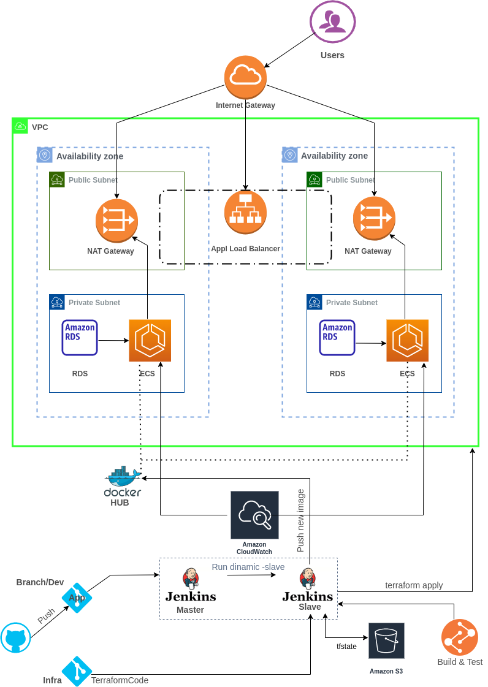

## В `GitHub` имеется 2 репозитория:  одно с приложением [App-adminer](https://github.com/LDevop/app) и с [инфраструктурой](https://github.com/LDevop/infra) описанная терраформ кодом.

В репозитории [App-adminer](https://github.com/LDevop/app) есть ветка `dev` где ведутся работы над выпуском новой [версии](https://github.com/LDevop/app/blob/main/adminer-4.8.2.php) и по новому `commit` разворачивается тестовое окружение для проверки работоспособности новой версии.

Тестовая инфраструктура разворачивается по триггеру от `Jenkins` master.    
В свою очередь из подготовленной `ami_id` начинается запуск `Jenkins-dynamic-slave` на котором производится тест [Dockerfile](https://github.com/LDevop/app/blob/main/Dockerfile) в данном случае используется [Hadolint](https://github.com/hadolint/hadolint/releases/tag/v2.10.0).   
После удачного завершения теста производится `build` и образ загружается в приватный репозиторий `Dockerhub` в качестве версии используется `sha` хэш коммита из `GitHub`

На следующем этапе стартует новая [jobs](https://github.com/LDevop/infra/blob/main/Jenkinsfile) где забирается весь код `terraform` и разворачивается `ecs-cluster` с нашим новым приложением.  

После успешной проверки приложения, инфраструктура выключается отдельной [jobs](https://github.com/LDevop/infra/blob/main/Jenkinsfile_destroy) вручную.

Также настроены уведомления в Telegram, где отображается:
- имя jobs
- название ветки
- состояние деплоя